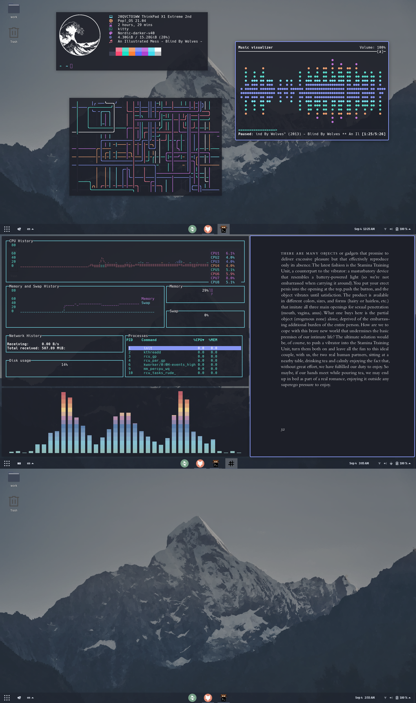

  

  <b>👉 vincent's configuration files 👈</b>

  
  
  

Contents:
- [Screenshots:](#screenshots)
- [MacOS - Dracula:](#macos---dracula)
- [PopOS - Nord:](#popos---nord)

---

## Screenshots:

---

## MacOS - Dracula: 

- *wm* – [yabai](https://github.com/koekeishiya/yabai)
- *bar* – [simple-bar](https://github.com/Jean-Tinland/simple-bar)
- *hotkey daemon* – [skhd](https://github.com/koekeishiya/skhd)
- *terminals:* 
  * [kitty](https://github.com/kovidgoyal/kitty)
  * [iterm2](https://iterm2.com/)
  * [hyper](https://hyper.is/)
- *editor* – [neovim](https://github.com/neovim/neovim)
  - *plugin* - [vapournvim](https://github.com/VapourNvim/VapourNvim)
- *editor* – [vscode](https://code.visualstudio.com/)
  - *theme* - [dracula](https://marketplace.visualstudio.com/items?itemName=dracula-theme.theme-dracula)
- *browser* – brave/firefox
- *theme* – [dracula](https://draculatheme.com/)
- *prompt* – [starship](https://starship.rs/)
- *prompt* – [oh-my-zsh](https://ohmyz.sh/)
- *fonts:*
  * [jetbrainsmono nerd font](https://www.nerdfonts.com/font-downloads)
  * [hack nerd font](https://www.nerdfonts.com/font-downloads)
  * [meslo nerd font](https://www.nerdfonts.com/font-downloads)
- *wallpapers* – [here](/images)
- *some terminal tools*:
    - [ag](https://github.com/ggreer/the_silver_searcher)
    - [ripgrep](https://github.com/BurntSushi/ripgrep)
    - [zoxide](https://github.com/ajeetdsouza/zoxide)
    - [exa](https://github.com/ogham/exa)
- *cool terminal stuff*:
    - [neofetch](https://github.com/dylanaraps/neofetch)
    - [bashtop](https://github.com/aristocratos/bashtop)
    - [yant](https://github.com/Cveinnt/yant)
    - [mpd+ncmpcpp](https://gist.github.com/sdushantha/fd0b4f7d69b814317bc33da3a57fdf49)
    - [lolcat](https://github.com/busyloop/lolcat)
    - [cava](https://github.com/karlstav/cava)
    - [pipes.sh](https://github.com/pipeseroni/pipes.sh)

## PopOS - Nord:

- *wm* – Pop OS default
- *terminals:* 
  * [kitty](https://github.com/kovidgoyal/kitty)
  * [hyper](https://hyper.is/)
- *editor* – [neovim](https://github.com/neovim/neovim)
  - *plugin* - [vapournvim](https://github.com/VapourNvim/VapourNvim)
- *editor* – [vscode](https://code.visualstudio.com/)
- *browser* – brave/firefox
- *pdf reader* - zathura
- *theme* – Nordic-darker-v40
- *prompt* – [oh-my-zsh](https://ohmyz.sh/)
- *fonts:*
  * [hack nerd font](https://www.nerdfonts.com/font-downloads)
  * [meslo nerd font](https://www.nerdfonts.com/font-downloads)
- *wallpapers* – [here](/images)
- *some terminal tools*:
    - [ag](https://github.com/ggreer/the_silver_searcher)
    - [ripgrep](https://github.com/BurntSushi/ripgrep)
    - [zoxide](https://github.com/ajeetdsouza/zoxide)
    - [exa](https://github.com/ogham/exa)
- *colorful terminal stuff*:
    - [gotop](https://github.com/)
    - [yant](https://github.com/Cveinnt/yant)
    - [neofetch](https://github.com/dylanaraps/neofetch)
    - ncmpcpp
    - [lolcat](https://github.com/busyloop/lolcat)
    - [cava](https://github.com/karlstav/cava)
    - [pipes.sh](https://github.com/pipeseroni/pipes.sh)
