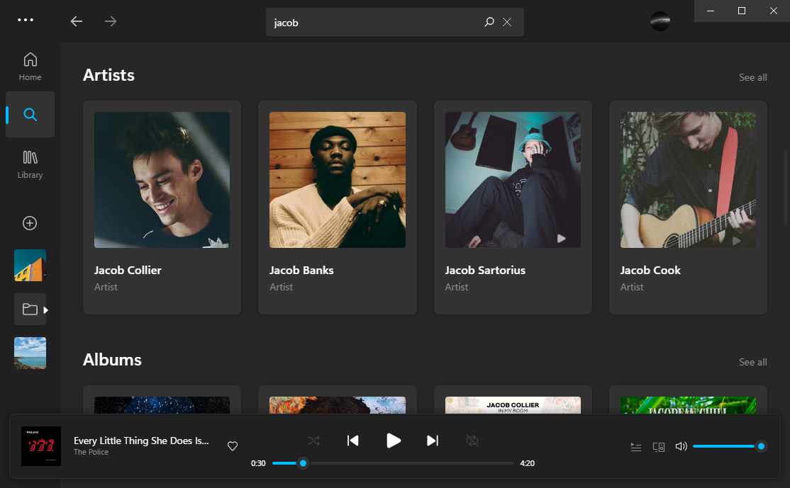
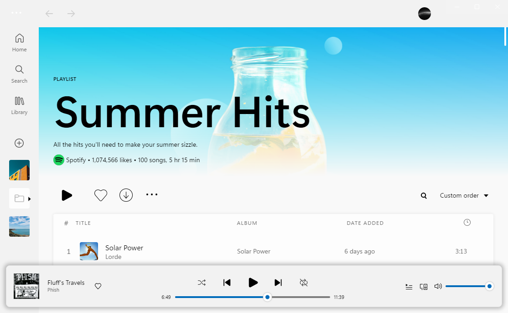

# Fluent

## Screenshots

### Dark



### Light


## More

### About

[Spicetify](https://github.com/khanhas/spicetify-cli) theme inspired by Windows 11 UI and Microsoft's Fluent Design.  
Requires Segoe UI font.

Based off [Ziro](https://github.com/schnensch0/ziro) theme by [schnensch](https://github.com/schnensch0)  
[Fluent UI System Icons](https://github.com/microsoft/fluentui-system-icons) by Microsoft Corporation  
[Phosphor Icons](https://github.com/phosphor-icons/phosphor-icons) by Phosphor Icons  

### Install

Run these commands:

#### Windows
In **Powershell**:
```powershell
cd "$(spicetify -c | Split-Path)\Themes\Fluent"
Copy-Item fluent.js ..\..\Extensions
spicetify config extensions fluent.js
spicetify config current_theme Fluent color_scheme dark
spicetify config inject_css 1 replace_colors 1 overwrite_assets 1
spicetify apply
```

#### macOS and Linux
In **Bash**:
```bash
cd "$(dirname "$(spicetify -c)")/Themes/Fluent"
mkdir -p ../../Extensions
cp fluent.js ../../Extensions/.
spicetify config extensions fluent.js
spicetify config current_theme Fluent color_scheme dark
spicetify config inject_css 1 replace_colors 1 overwrite_assets 1
spicetify apply
```

### Customization

Two color schemes are available: `light` or `dark`. Change scheme with commands:
```
spicetify config color_scheme <scheme_name>
spicetify apply
```
You can change the accent color in the theme folder's color.ini file.  
If you are using Windows, you can hide the window controls by adding the flag `--transparent-window-controls` after Spotify.exe in your Spotify shortcut.
